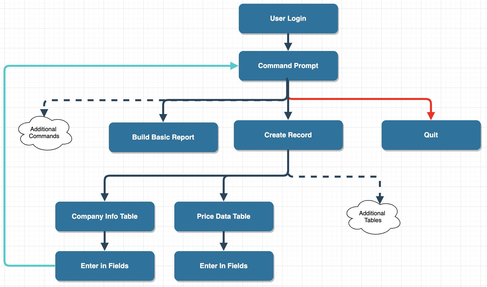
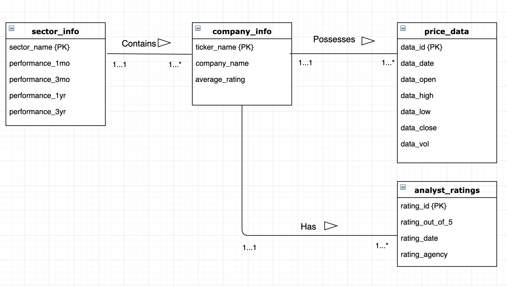
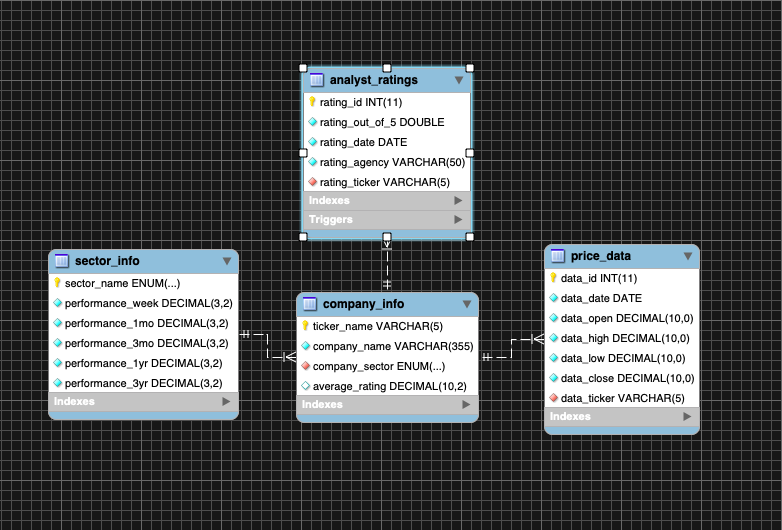

# Project Clarendon
This project will allow users to build financial reports based off of historical monthly stock prices as well as perform commands on the database. We are going to pull our various financial data from the Alpha Vantage API available online and store the data inside of a mySQL database. We are utilizing java as the front-end of our application.

### Create and Running the Application
1. Download and run the SQL dump `ProjectClarendonDump.sql` inside the back-end files folder into your mySQLWorkbench.
2. Download the java src file `ProjectClarendon.java` inside of the front-end files folder and open it in your IDE of choice.
3. Run the main method `main(String args[])` inside of the `ProjectClarendon` class.
4. Follow the directions provided by the application to perform commands.

### Java Front-End Functionality
##### Currently Supported Commands
- `CREATE` - handles new insertions into the database
- `DELETE` - handles object deletions from the database
- `READ` - handles queries into the database 
- `UPDATE` - handles updates on company names 
- `BUILD_REPORT` - builds a financial report on a stock
- `FIND_HIGH` - returns the 52w high of a stock
- `FIND_LOW` - returns the 52w low of a stock
- `QUIT` - disconnects from the database 

When the user runs the application, the application will request commands via System.in and provides instructions to the user according to the commands that they choose. L

### mySQL Back-End Functionality
##### Procedures
`initialize_avg_rating` - Consumes an input ticker name and initializes the average rating column inside of the company info table for the ticker

`build_basic_report` - Consumes a stock ticker and builds basic financial report on the company name, ticker, 52w high, 52w low, average rating, stock sector, and the stock sector's 1yr performance

##### Functions
`find_52w_high` - This function yields the 52week high of a provided input stock

`find_52w_low` - This function yields the 52week low of a provided input stock

##### Triggers
`avg_rating_after_insert` - This trigger activates after there is an insertion in the analyst ratings table and updates the average rating field in the "company_info" table

### Technical Specifications
SQL will be used for the internals of our DB. Alpha Vantage API (https://www.alphavantage.co/) will be used to obtain stock/financial data for our project. A terminal will be used to access the Alpha Vantage API (a historical stock price repository) online via the curl command and Microsoft Excel will be used to open and access csv’s, if necessary. In addition, MySQLWorkbench will be utilized to store that information of the historical stock prices as well as read the csv’s. We will utilize Java and IntelliJ along with mySQL scripts to perform applications of financial and quantitative analysis on the data in the database. At this point in time, the DB will have limited connectivity as it will not be stored on a cloud server. Rather, the DB is to be stored on a computer and is accessed by mySQL Workbench (version 8.0.16).  For his project, we decided to leverage GitLab as our file sharing application to keep track of versions and updates throughout the project process. 

### System User Flow

If DB is not installed, follow the steps on the “Creating and Running the Application” section. The above diagram maps the user flow of the DB. Upon running the java file of the DB, the user will be greeted with a command line and be prompted to login with their credentials (set via MySQL Workbench). Upon successful login, the user will be prompted to enter in an option (i.e. one of the CRUD operations, building a basic report, etc.).

For this example, the user will be trying to create a record in the Company Infor table. The user will then type in the CREATE option, then will type in which table to add the new record. Upon entering all the data in the required fields, the user will execute the command and once finished, the prompt will bring the user back to beginning command prompt. From here, the user will either execute more actions or quit the application and disconnect.

### UML Diagram

### EER Diagram

### Lessons Learned
We learned a variety of things ranging from the back-end to the front-end as well as utilizing other applications. On the back-end side of things, we learned how to utilize functions and procedures in tandem in order to produce outputs that we desired. Also, we gained knowledge on creating schemas from scratch and realized that we should have spent more time up front discussing and considering different edge cases as this would save a lot of time later on. We had to go back and change small things inside of our schema, resulting in lots of repeated work and time wasted. 

On the front-end side of things, we gained experience with connecting java to mySQL databases. We figured out how to properly prompt users for input as well as set up scripts appropriate to run on the back-end. Through hours and hours on stackoverflow troubelshooting our problems, we learned that in the future, we should set up scripts entirely on the back-end side of things, and have the front-end strictly as a "caller" of these scripts.

With regards to group work, we learned how to utilize GitLab appropriately to optimize our work flow. It was very easy to coordinate back and forth and to see what each other were working on through git log commands in the terminal. In the future, we would spend more time creating goals and tasks to complete in order to build and walk through a timeline for the project. We did not allocate time appropriately throughout the semester and so had to put up a lot of time towards the end of the semester. 

Our application is fully operational and performs all commands on the front end appropriately. However, the functionality for some of the commands, such as `DELETE`, `UPDATE`, and `BUILD_REPORT` provide only limited functionality at the moment. We plan on continuing to work on this project in the future to address these limited functionalities as well as add additional functionality. 

### Future Work
We plan on continuing this project into the future and will use the database as a storage area for any stocks that we want to analyze. As we expand functionality, such as running smoothly interacting with the program through the terminal, adding real-time data, or writing more complicated scripts to run, we will be able to utilize the database to a larger extent. Potentially, we could use this program in our careers down the line as Scott is going to be in the finance field moving forward. 

Our next goal is going to be to streamline the process using the terminal, allowing users to download a single application that allows them to request, query, view, and export data using only commands in the terminal that we provide to them. 

### Miscellanous Information
API Key for AlphaVantage: F9KH4BPQW8KLKPBA

Links used to download price data and sector data
https://www.alphavantage.co/query?function=TIME_SERIES_DAILY_ADJUSTED&symbol=CCI&outputsize=full&apikey=F9KH4BPQW8KLKPBA&datatype=csv

https://www.alphavantage.co/query?function=SECTOR&apikey=F9KH4BPQW8KLKPBA&datatype=csv

Database values downloaded and created on: 6/17/19
